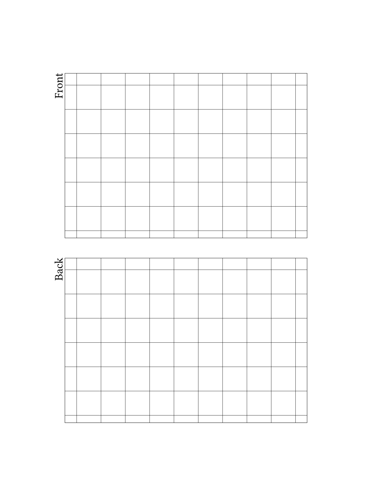

# rm2anki

> [!WARNING]
> rm2anki uses [a library](https://github.com/ax3l/lines-are-rusty) for rendering notebooks that does not support the new lines format version 6.
> This means that notebooks created with OS versions 3.x will not work as input.
> OS version 2.15.1.1189 is known to create notebook files that can be parsed.

This tool allows you to write flashcards on a reMarkable paper tablet and then convert them into Anki Decks.

* 1 notebook = 1 Anki deck
* The name of the deck is either the notebook name or the filename
* Editing cards works by reconverting the notebook. Learning progress is not lost.


## Usage

```
Usage: rm2anki [OPTIONS] <OUTPUT> [NOTEBOOKS]...

Arguments:
  <OUTPUT>        Path to the destination .apkg
  [NOTEBOOKS]...  Path to a notebook in rmapi zip file format

Options:
  -a, --anki-media-dir <ANKI_MEDIA_DIR>
          Path to Anki collection.media directory
  -n, --name-from-filename
          Use zipfile basename as deck name. Default is to use notebook name.
  -h, --help
          Print help
  -V, --version
          Print version
```

The input to this tool are notebook zip files generated by [rmapi](https://github.com/juruen/rmapi).

## Template
To write flashcards, either install the provided template pictured below or provide your own.



### Installation

If you prefer a GUI to do this, maybe try [rM2 Template Helper](https://www.freeremarkabletools.com/).

The following commands assume that you have SSH access to your remarkable and your current work directory is this repository.
Then you can run:

```sh
cd templates
scp flashcard.* root@10.11.99.1:/usr/share/remarkable/templates
```

Then you also need to register the template on the remarkable in a json file by pasting the below lines into the array under the path `/usr/share/remarkable/templates/templates.json`:

```json
{
    "name": "Flashcards",
    "filename": "flashcard",
    "iconCode": "\ue9d7",
    "categories": [
        "Life/organize"
    ]
}
```

### Designing your own

Right now, the area of the drawing that is extracted into the cards is fixed.
The bounding boxes given relative to width and height respectively are x=0.1740, y=0.1474, w=0.6519, h=0.3326 for the front and y=0.5200 for the back of a card.
As long as the cards in your template have the same size and position, they should import just fine.
The background is removed during import.
